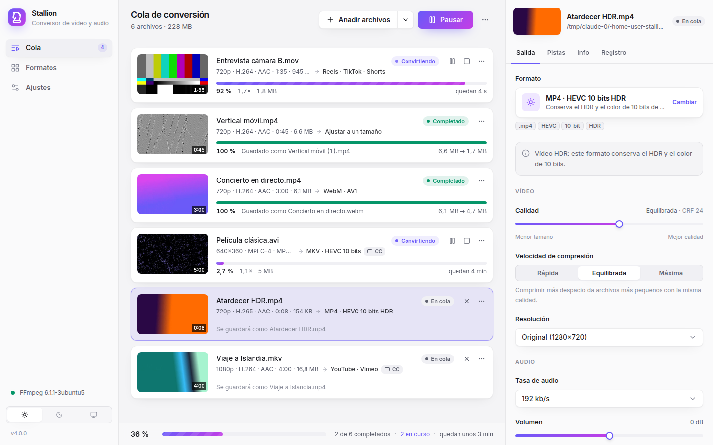
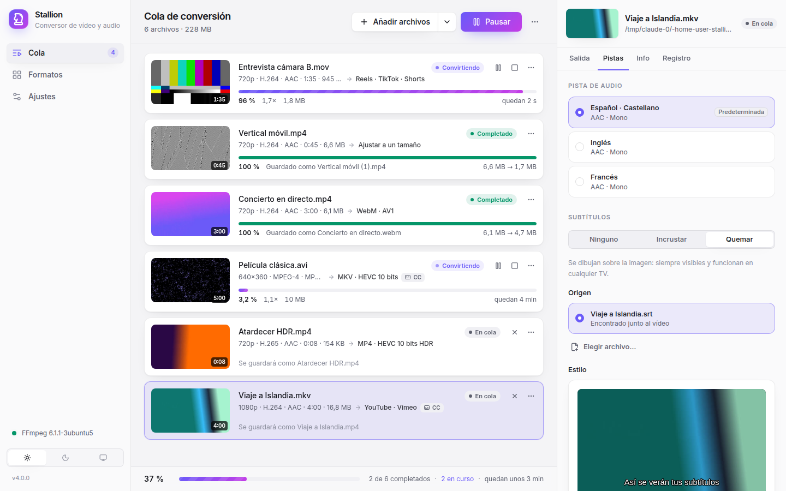
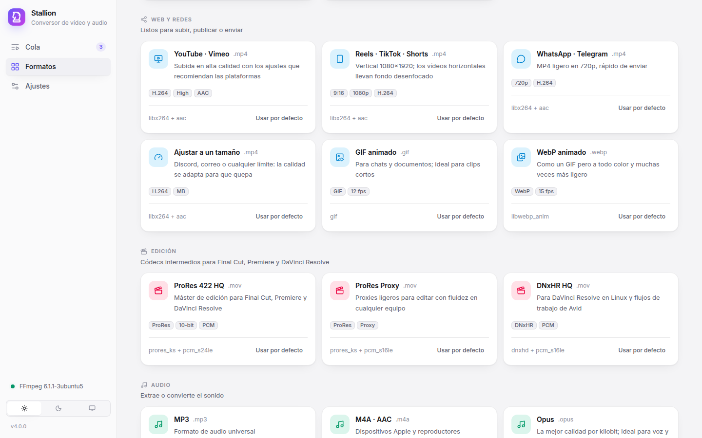
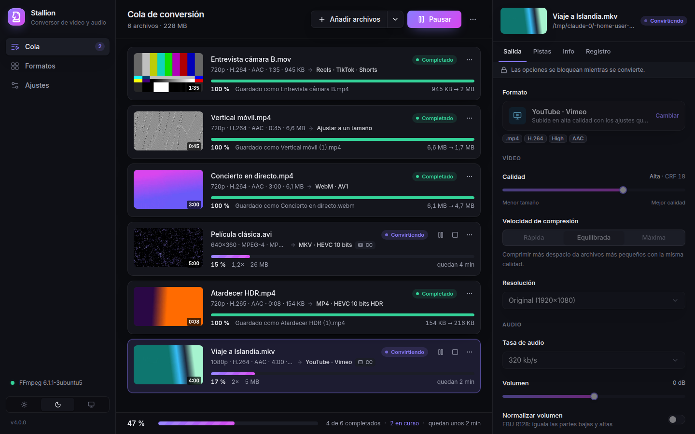

# Stallion

Modern video and audio converter powered by FFmpeg. The same web-based UI runs as a **desktop app** (native window) or as a **self-hosted service in Docker**.



## Features

- **34 ready-made formats** in six groups:
  - **Video**: MP4 (H.264, H.265/HEVC, HEVC 10-bit HDR, AV1), WebM (AV1 or VP9 + Opus), MKV (HEVC 10-bit, H.264).
  - **Web & social**: YouTube/Vimeo upload, vertical 1080×1920 for Reels/TikTok/Shorts (horizontal videos get a blurred background), WhatsApp/Telegram, *fit a size limit* (e.g. 10 MB for Discord or 25 MB for email), animated GIF and animated WebP.
  - **Editing**: ProRes 422 HQ, ProRes Proxy and DNxHR HQ for Final Cut, Premiere and DaVinci Resolve.
  - **Audio**: MP3, M4A (AAC), Opus, FLAC, ALAC (Apple Lossless) and WAV.
  - **No re-encoding**: lossless remuxing to MKV/MP4.
  - **Classic**: AVI (Xvid), WMV, FLV and DVD/SVCD/VCD (PAL and NTSC), kept for old players.
- **HDR aware**: 10-bit formats keep HDR10/HLG; 8-bit formats tone-map HDR to SDR (BT.709) so colors don't look washed out (needs FFmpeg with `zscale`, included in the Docker image).
- **Target size**: pick a size in MB and Stallion derives the bitrate and a sensible resolution from the duration, accounting for container overhead. In tests, files landed at 93–96 % of the limit.
- **Per-file control**: quality (CRF, bitrate or 0–100), encoding speed, resolution (never upscales, handles portrait and anamorphic video), audio bitrate, volume and EBU R128 loudness normalization.
- **Audio tracks**: pick the language you want; remuxing keeps every track.
- **Subtitles**: burn them in or embed them as a track, from embedded tracks (text or PGS/VobSub images) or external `.srt/.ass/.ssa/.vtt` files. A matching `.srt` next to the video is picked up automatically, Windows-1252 files are detected, and a style editor shows a live preview.
- **Queue**: parallel conversions, pause/resume/cancel/retry, live progress with speed and ETA, thumbnails, batch editing, and the exact `ffmpeg` command for every job.
- **Spanish and English UI**, light theme by default with an optional dark mode, keyboard shortcuts.
- **Headless CLI** for scripts and servers.

| Tracks and subtitles | Formats | Dark mode |
| --- | --- | --- |
|  |  |  |

## Quick start

### Desktop app

Requires Python 3.11+, FFmpeg and Node.js 20+ (only to build the UI once).

```bash
make install   # venv + backend (editable) + UI dependencies
make run       # builds the UI and opens the native window
```

On Linux the native window uses Qt WebEngine (installed by the `desktop` extra). Without it, Stallion opens in your default browser instead: `stallion desktop --browser`.

### Docker / NAS

```bash
cp .env.example .env        # set STALLION_TOKEN and MEDIA_DIR
docker compose up -d
# open http://localhost:8000/auth?token=<STALLION_TOKEN>
```

The container runs as an unprivileged user, ships FFmpeg and subtitle fonts, and only sees the folder mounted at `/media`.

### Command line

```bash
stallion presets                                    # list format ids
stallion convert *.mkv -p mp4-h265 -o converted/ --max-height 1080 -j 2
stallion convert talk.mp4 -p mp3 --subtitles none
stallion convert clip.mov -p share-size -q 25                   # fit in 25 MB
stallion convert trip.mp4 -p social-vertical                    # 1080×1920 for Reels/TikTok
stallion convert hdr.mov -p mp4-hevc-10bit                      # keep HDR
stallion serve --host 0.0.0.0 --media-root /srv/videos
```

`convert` exits non-zero when any file fails, so it composes well with scripts and cron.

## Configuration

| Variable | Default | Purpose |
| --- | --- | --- |
| `STALLION_HOST` / `STALLION_PORT` | `127.0.0.1` / `8000` | Bind address for `stallion serve` |
| `STALLION_TOKEN` | random, printed at start | Access token for the web UI and API |
| `STALLION_AUTH` | `on` | `off` disables authentication (only behind a proxy that authenticates users) |
| `STALLION_MEDIA_ROOTS` | home folder (+ `/media`, `/mnt`) | Folders the UI may read and write, separated by `:` (`;` on Windows) |
| `STALLION_DATA_DIR` | platform data folder | Settings and thumbnail cache |
| `STALLION_FFMPEG` / `STALLION_FFPROBE` | found in `PATH` | FFmpeg binaries |
| `STALLION_ALLOWED_ORIGINS` | none | Extra origins allowed to open the WebSocket (reverse proxies) |
| `FORWARDED_ALLOW_IPS` | `127.0.0.1` | Proxies trusted for `X-Forwarded-*` headers |

The desktop app picks a random port and token on every launch and passes them to its own window.

## Security model

- Every API call requires the token, sent as an `HttpOnly`, `SameSite=Strict` cookie or an `Authorization: Bearer` header. The WebSocket also checks the `Origin`.
- File access is confined to the media roots after resolving `..` and symlinks, so URLs and other FFmpeg protocols never reach `ffmpeg`/`ffprobe`.
- The FFmpeg binary is chosen by the server, never by the client.
- FFmpeg runs with `-nostdin`, its output pipes are drained concurrently (no deadlocks on noisy input), and every child process is terminated on cancel, window close or shutdown.
- Responses carry a strict Content-Security-Policy, `X-Frame-Options: DENY` and `nosniff`.

## Development

```bash
make install
make dev-api     # backend on :8000 with token "dev"
make dev-ui      # Vite with hot reload → http://localhost:5173/auth?token=dev
make check       # ruff + mypy + tsc + pytest
```

The test-suite runs every preset through real FFmpeg when it is installed; set `STALLION_SKIP_FFMPEG_TESTS=1` to run only the pure unit tests.

```
stallion/engine/   ffprobe/ffmpeg layer: presets (JSON), command builder, async runner
stallion/jobs.py   queue: scheduling, pause/resume/cancel, change events
stallion/api/      FastAPI REST + WebSocket, token auth, serves the web UI
stallion/desktop.py  private local server + native window (pywebview)
stallion/cli.py    `stallion` / `stallion serve` / `stallion convert`
frontend/          React 19 + TypeScript + Tailwind CSS 4 + Radix UI (built into stallion/web/dist)
legacy/            the original GTK + mencoder application, kept for reference
```

## Legacy version

Stallion 3.x was a GTK interface for mencoder (2011–2014). It needs Python 2, mencoder and Ubuntu Unity, none of which are maintained anymore; its code is preserved in [`legacy/`](legacy/). Version 4 keeps its spirit (presets, subtitles, track selection, queue) on a modern FFmpeg engine.

Copyright 2013-2014 Lino Alfonso <lino@lt.desoft.cu>
