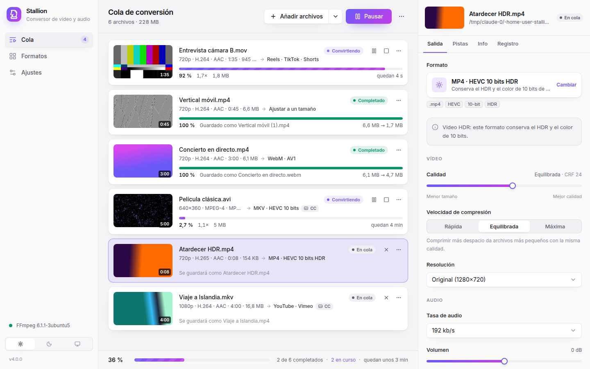
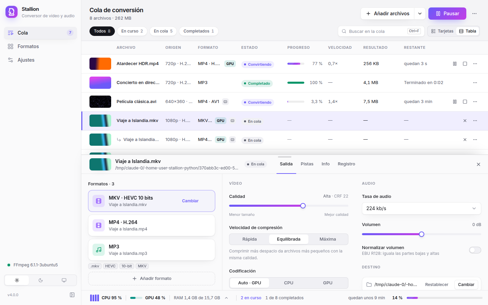
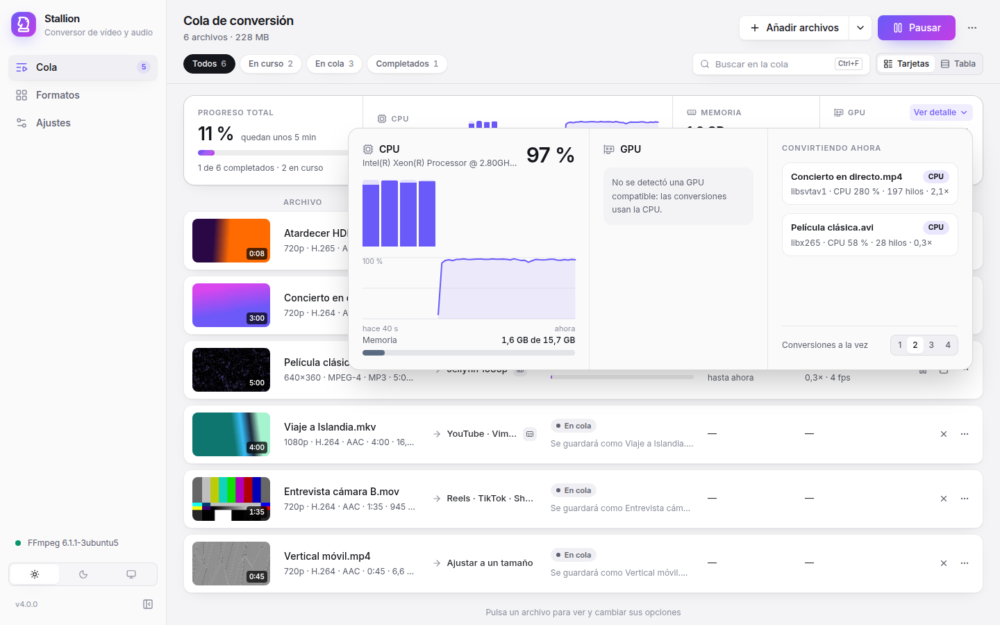
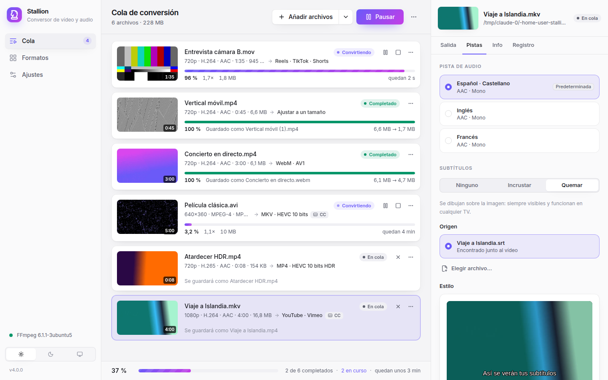
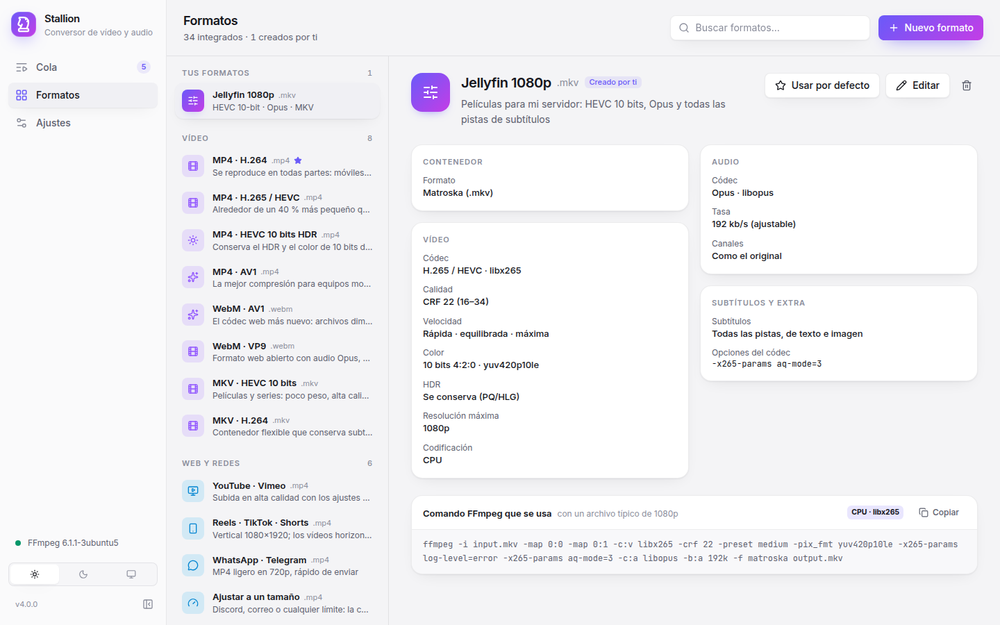
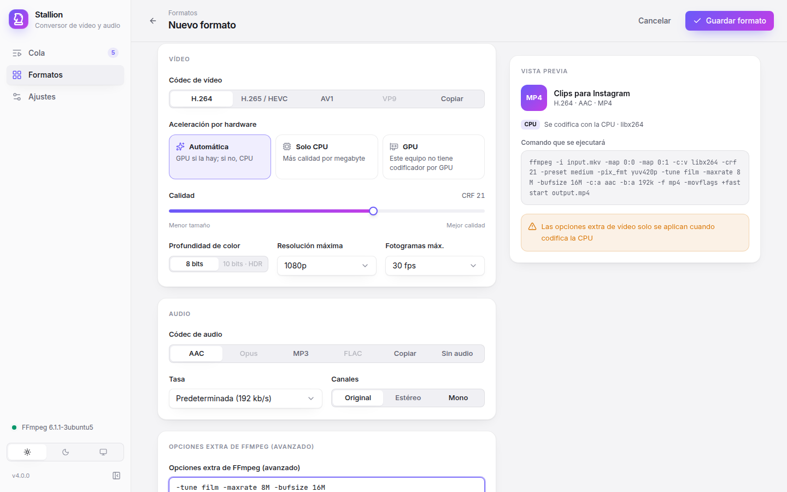
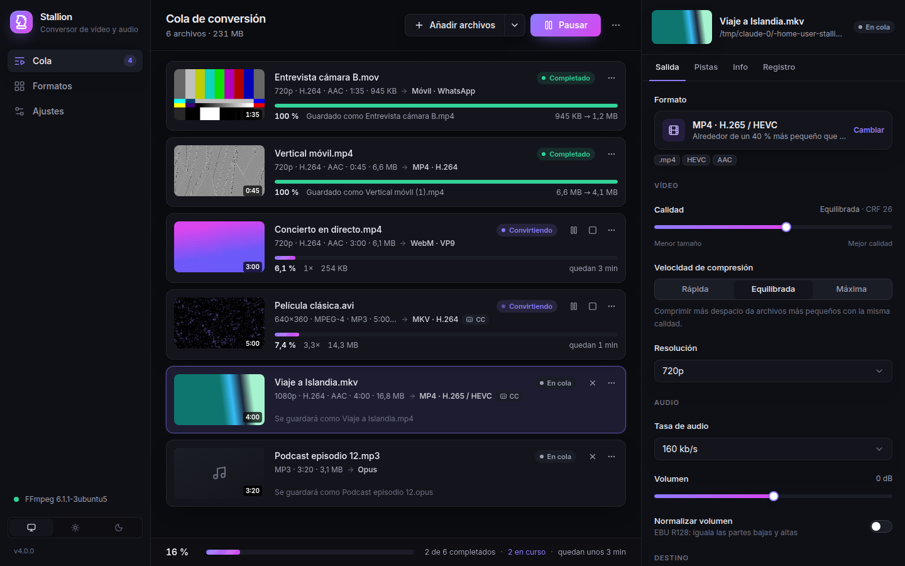

<p align="center">
  
</p>

<h1 align="center">Stallion</h1>

<p align="center">
  A friendly video and audio converter for Linux, powered by FFmpeg.<br>
  <em>Un conversor de vídeo y audio amable, en español y en inglés.</em>
</p>

<p align="center">
  <a href="https://github.com/lam1623/stallion-python/actions/workflows/ci.yml"></a>
  <a href="LICENSE"></a>
  
</p>



Stallion turns the videos and songs you give it into the format you need: MP4 for the TV, a vertical clip for Reels, a file small enough for an email, or FLAC for your music collection. Pick a ready-made format or make your own, and Stallion takes care of FFmpeg for you. It runs as a desktop app with its own window, or as a small service on a home server that you open from any browser.

## A little history


Stallion started in 2011, when **Lino Alfonso** wrote a GTK interface for mencoder, the encoder of the MPlayer project, so that converting a video took a few clicks instead of a page of command-line options. It came with presets for the formats of its day (AVI with XviD and DivX, VCD, SVCD and DVD, FLV, MP4, WMV and MP3), subtitles, a queue, a tray icon and an option to shut the computer down when the queue finished. It grew version after version until 3.0.6 in 2014, with its own website at stallionv.wordpress.com.

Its building blocks did not age as well as the idea: mencoder, Python 2 and the Unity desktop are gone. **Stallion 4** is a full rebuild that keeps what made the original worth using (ready-made formats, subtitles, audio tracks, a simple queue) on a modern FFmpeg engine, and adds a new interface, GPU encoding, HDR, your own formats and several formats from one file.

The original application is preserved, untouched, in [`legacy/`](legacy/).

## Install

### Linux packages

Download the package for your distribution from the [releases page](https://github.com/lam1623/stallion-python/releases). The packages bring their own Python and Qt; your package manager adds FFmpeg and the usual desktop libraries they use.

| Distribution | Package | Install with |
| --- | --- | --- |
| Ubuntu 22.04+, Debian 12+, Linux Mint 21+, Pop!_OS 22.04+ | `stallion_4.0.0-1_amd64.deb` | `sudo apt install ./stallion_4.0.0-1_amd64.deb` |
| Fedora, openSUSE Tumbleweed | `stallion-4.0.0-1.x86_64.rpm` | `sudo dnf install ./stallion-4.0.0-1.x86_64.rpm` or `sudo zypper install --allow-unsigned-rpm ./stallion-4.0.0-1.x86_64.rpm` |
| Arch, Manjaro, EndeavourOS | `stallion-4.0.0-1-x86_64.pkg.tar.zst` | `sudo pacman -U ./stallion-4.0.0-1-x86_64.pkg.tar.zst` |
| Any other distribution with glibc 2.35+ | `stallion-4.0.0-linux-x86_64.tar.gz` | unpack it and run `./stallion`, or `./install.sh` to add it to your menu |

Stallion then appears in your applications menu, and `stallion` starts it from a terminal (`stallion convert` and the other commands below work too). Fedora and openSUSE build their FFmpeg without the H.264 and HEVC software encoders (x264 and x265); the full FFmpeg from [RPM Fusion](https://rpmfusion.org/) or [Packman](https://en.opensuse.org/Additional_package_repositories#Packman) adds them. Formats your FFmpeg cannot encode stay greyed out, with the missing encoder named.

Before a release is published, each package is installed and tried on fresh containers of the distributions above (see [Releases](#releases)). To build them yourself: `make packages` (needs Docker) writes them to `dist/linux/`.

### Docker or a home server

The ready-made image runs on amd64 and arm64 machines, such as a Raspberry Pi 4 or 5 or most NAS boxes:

```bash
docker run -d --name stallion --restart unless-stopped -p 8000:8000 \
  -e STALLION_TOKEN=change-me -v /path/to/videos:/media \
  ghcr.io/lam1623/stallion-python:latest
# open http://localhost:8000/auth?token=change-me
```

Or build it from a checkout with Compose:

```bash
cp .env.example .env        # set STALLION_TOKEN and MEDIA_DIR
docker compose up -d        # also after a git pull: the image is rebuilt from the checkout
# open http://localhost:8000/auth?token=<STALLION_TOKEN>
```

The container runs as an unprivileged user, ships FFmpeg and subtitle fonts, and only sees the folder mounted at `/media`. For GPU encoding on Intel or AMD hosts, set `STALLION_VAAPI=1` and `RENDER_GID` in `.env` and uncomment `devices` in `compose.yaml`: the image then includes the VA-API drivers and the container can use `/dev/dri`.

### From source

For development, or on a system without the packages. Requires Python 3.11+, FFmpeg and Node.js 20+ (to build the UI).

```bash
make install   # venv + backend (editable) + UI dependencies
make run       # builds the UI and opens the native window
```

After a `git pull`, run `make run` again: it reinstalls changed dependencies, and `stallion` rebuilds the UI whenever `frontend/` changed since the last build.

On Linux the native window uses Qt WebEngine (installed by the `desktop` extra). Without it, Stallion opens in your default browser instead: `stallion desktop --browser`.

## Features

- **34 ready-made formats** in six groups:
  - **Video**: MP4 (H.264, H.265/HEVC, HEVC 10-bit HDR, AV1), WebM (AV1 or VP9 + Opus), MKV (HEVC 10-bit, H.264).
  - **Web & social**: YouTube/Vimeo upload, vertical 1080×1920 for Reels/TikTok/Shorts (horizontal videos get a blurred background), WhatsApp/Telegram, *fit a size limit* (e.g. 10 MB for Discord or 25 MB for email), animated GIF and animated WebP.
  - **Editing**: ProRes 422 HQ, ProRes Proxy and DNxHR HQ for Final Cut, Premiere and DaVinci Resolve.
  - **Audio**: MP3, M4A (AAC), Opus, FLAC, ALAC (Apple Lossless) and WAV.
  - **No re-encoding**: lossless remuxing to MKV/MP4.
  - **Classic**: AVI (Xvid), WMV, FLV and DVD/SVCD/VCD (PAL and NTSC), kept for old players.
- **Your own formats**: a format editor covers container, codec, quality, 10-bit color, resolution and frame-rate limits, audio, CPU/GPU preference and a vetted set of extra encoder options. It shows a live preview of the exact FFmpeg command and flags combinations that cannot work before you save. Built-in formats can be duplicated and tweaked, and every format shows its parameters and the command it runs.
- **GPU encoding**: NVIDIA NVENC, Intel Quick Sync, VA-API (Intel/AMD on Linux), AMD AMF (Windows) and Apple VideoToolbox. At startup each GPU encoder has to pass a short test encode before it is offered. H.264, HEVC (10-bit when the GPU supports it) and AV1 formats then use the GPU automatically. You can switch this off globally or per file, and a file the GPU cannot handle is converted on the CPU instead.
- **Live activity monitor**: per-core CPU load, memory and GPU load (video encoder, decoder, VRAM), each with a minute of history, plus the CPU use of every running conversion.
- **HDR aware**: 10-bit formats keep HDR10/HLG; 8-bit formats tone-map HDR to SDR (BT.709) so colors don't look washed out (needs FFmpeg with `zscale`, included in the Docker image).
- **Target size**: pick a size in MB and Stallion derives the bitrate and a sensible resolution from the duration, accounting for container overhead. In tests, files landed at 93–96 % of the limit.
- **Per-file control**: quality (CRF, bitrate or 0–100), encoding speed, resolution (never upscales, handles portrait and anamorphic video), audio bitrate, volume and EBU R128 loudness normalization.
- **Audio tracks**: pick the language you want; remuxing keeps every track.
- **Subtitles**: burn them in or embed them as a track, from embedded tracks (text or PGS/VobSub images) or external `.srt/.ass/.ssa/.vtt` files. A matching `.srt` next to the video is picked up automatically, Windows-1252 files are detected, and a style editor shows a live preview.
- **Several formats per file**: convert one video to MP4, WebM and MP3 at once, for example. Each format is its own job with its own settings. Outputs that would share a name are named after their format, e.g. `clip (HEVC).mp4`.
- **Queue**: a dense table (the default) or full-width cards, status filters and search, parallel conversions, pause/resume/cancel/retry, live progress with speed and ETA, thumbnails, batch editing, and the exact `ffmpeg` command for every job. Options open only for the file you pick: under the table, or beside the cards (floating or pinned). You can resize the panel, and its size and the view are remembered.
- **Spanish and English UI**, light theme by default with an optional dark mode, keyboard shortcuts.
- **Headless CLI** for scripts and servers.

| Table view | Activity monitor | Tracks and subtitles |
| --- | --- | --- |
|  |  |  |

| Formats | Format editor | Dark mode |
| --- | --- | --- |
|  |  |  |

## Command line

```bash
stallion presets                                    # list format ids (yours included)
stallion convert *.mkv -p mp4-h265 -o converted/ --max-height 1080 -j 2
stallion convert talk.mp4 -p mp3 --subtitles none
stallion convert clip.mov -p share-size -q 25                   # fit in 25 MB
stallion convert trip.mp4 -p social-vertical                    # 1080×1920 for Reels/TikTok
stallion convert hdr.mov -p mp4-hevc-10bit                      # keep HDR
stallion convert *.mov -p mp4-h265 --accel gpu                  # encode on the GPU (cpu/auto)
stallion convert talk.mkv -p mp4-h264 -p webm-av1,mp3           # several formats per file
stallion serve --host 0.0.0.0 --media-root /srv/videos
```

`convert` exits non-zero when any file fails, so it composes well with scripts and cron.

## Configuration

| Variable | Default | Purpose |
| --- | --- | --- |
| `STALLION_HOST` / `STALLION_PORT` | `127.0.0.1` / `8000` | Bind address for `stallion serve` |
| `STALLION_TOKEN` | random, printed at start | Access token for the web UI and API |
| `STALLION_AUTH` | `on` | `off` disables authentication (only behind a proxy that authenticates users) |
| `STALLION_MEDIA_ROOTS` | home folder (+ `/media`, `/mnt`) | Folders the UI may read and write, separated by `:` (`;` on Windows) |
| `STALLION_DATA_DIR` | platform data folder | Settings and thumbnail cache |
| `STALLION_FFMPEG` / `STALLION_FFPROBE` | found in `PATH` | FFmpeg binaries |
| `STALLION_ALLOWED_ORIGINS` | none | Extra origins allowed to open the WebSocket (reverse proxies) |
| `STALLION_HWENC` | `on` | `off` skips GPU encoder detection, so everything is encoded on the CPU |
| `STALLION_AUTOBUILD` | `on` | In a source checkout, rebuild the UI at startup when `frontend/` changed (needs npm); `off` serves the existing build |
| `FORWARDED_ALLOW_IPS` | `127.0.0.1` | Proxies trusted for `X-Forwarded-*` headers |

The desktop app picks a random port and token on every launch and passes them to its own window.

## Security model

- Every API call requires the token, sent as an `HttpOnly`, `SameSite=Strict` cookie or an `Authorization: Bearer` header. The WebSocket also checks the `Origin`.
- File access is confined to the media roots after resolving `..` and symlinks, so URLs and other FFmpeg protocols never reach `ffmpeg`/`ffprobe`.
- The FFmpeg binary is chosen by the server, never by the client.
- Custom formats are built from fixed codec tables. Their extra options must match an allowlist of encoder flags, each with a strict value pattern, so a format can never add inputs, outputs, filters, file paths or protocols.
- FFmpeg runs with `-nostdin`, its output pipes are drained concurrently (no deadlocks on noisy input), and every child process is terminated on cancel, window close or shutdown.
- Responses carry a strict Content-Security-Policy, `X-Frame-Options: DENY` and `nosniff`.

## Development

```bash
make install
make dev-api     # backend on :8000 with token "dev"
make dev-ui      # Vite with hot reload → http://localhost:5173/auth?token=dev
make check       # ruff + mypy + tsc + pytest
```

The test-suite runs every preset through real FFmpeg when it is installed; set `STALLION_SKIP_FFMPEG_TESTS=1` to run only the pure unit tests.

```
stallion/engine/   ffprobe/ffmpeg layer: presets (JSON), command builder, async runner
stallion/jobs.py   queue: scheduling, pause/resume/cancel, change events
stallion/api/      FastAPI REST + WebSocket, token auth, serves the web UI
stallion/desktop.py  private local server + native window (pywebview)
stallion/cli.py    `stallion` / `stallion serve` / `stallion convert`
frontend/          React 19 + TypeScript + Tailwind CSS 4 + Radix UI (built into stallion/web/dist)
packaging/linux/   .deb, .rpm, Arch and portable packages (PyInstaller + nfpm)
legacy/            the original GTK + mencoder application, kept as it was
```

## Releases

A release is one version bump: set `__version__` in `stallion/__init__.py` and add a `<release>` entry for it to `packaging/linux/io.github.lam1623.stallion.metainfo.xml` (a test checks both). Once that reaches `master`, the [Packages and releases](.github/workflows/packages.yml) workflow:

1. builds the .deb, .rpm, Arch and portable packages;
2. installs and tries each one on fresh Ubuntu 24.04, Ubuntu 22.04, Debian 12, Fedora 42, openSUSE Tumbleweed and Arch containers;
3. publishes the `v<version>` release with every package, their checksums and install instructions;
4. pushes `ghcr.io/lam1623/stallion-python:<version>` and `:latest` for amd64 and arm64.

Pushes that keep the version build and test the packages too, and leave them in the workflow run's artifacts.

## Credits and license

Stallion is created and maintained by **Lino Alfonso** ([lleisdier.alfonso@gmail.com](mailto:lleisdier.alfonso@gmail.com)). Ideas, bugs and translations are welcome in the [issues](https://github.com/lam1623/stallion-python/issues).

Copyright © 2011–2026 Lino Alfonso. Stallion is free software, released like the original under the [GNU General Public License v3](LICENSE). The Linux packages bundle Python, Qt 6 and PyQt6, each under its own license, and use the FFmpeg of your system.
